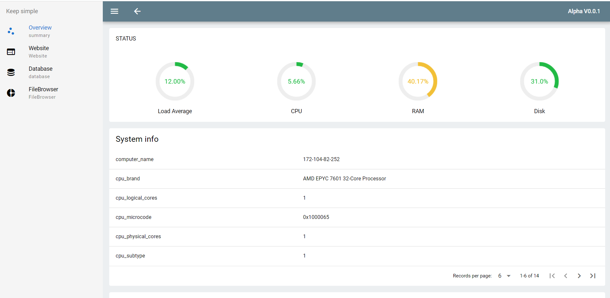
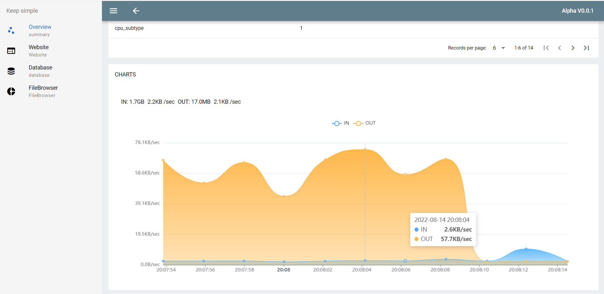
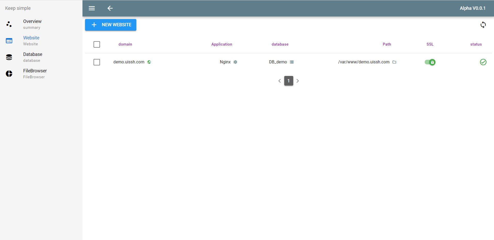
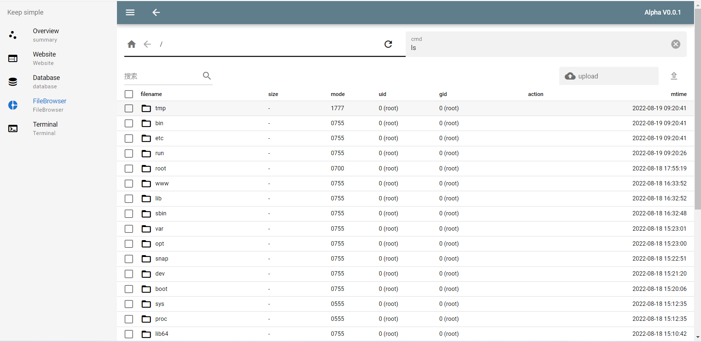
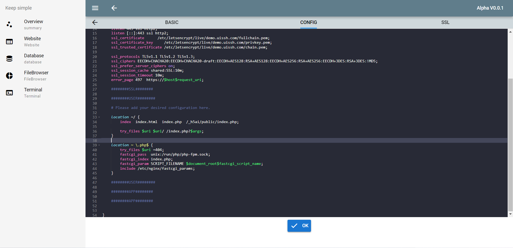
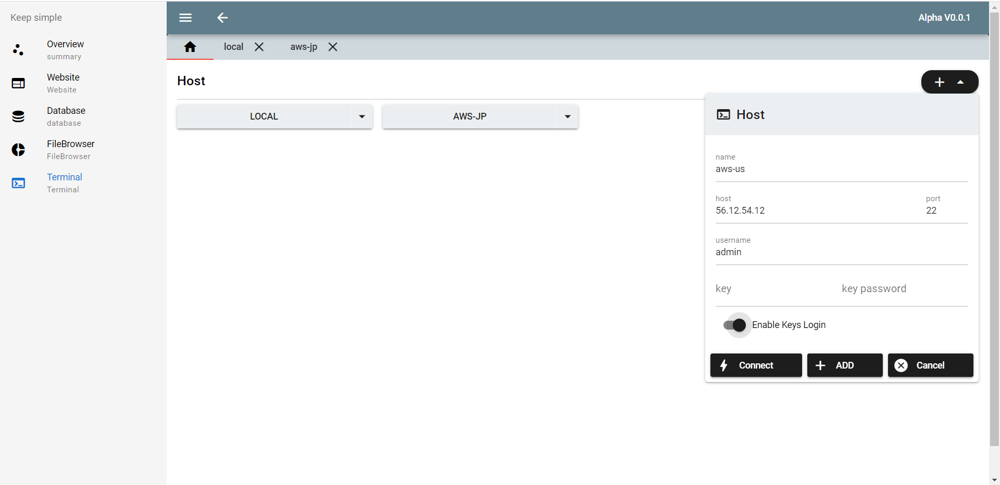

## Feature
- One-click deployment of LNMP
- Adding websites and enabling SSL
- File browsing and file code highlight editing
- Database management and PHPMyAdmin
- Terminal access
## Deploy

> Only supports newly created initial systems of Debian 11

One-click deployment using [this script]('https://github.com/UISSH/install-script')

## Screenshot 

